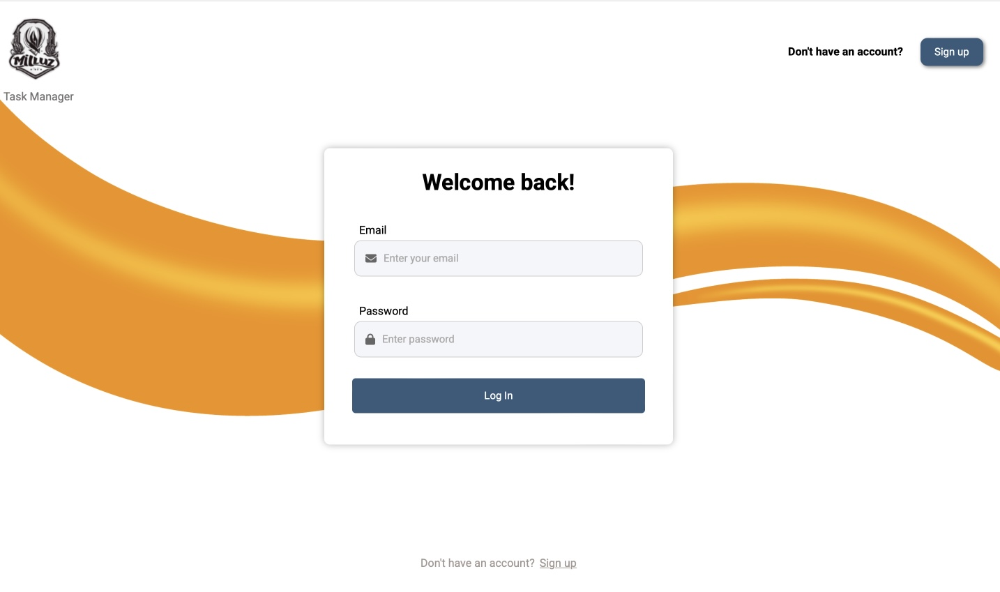
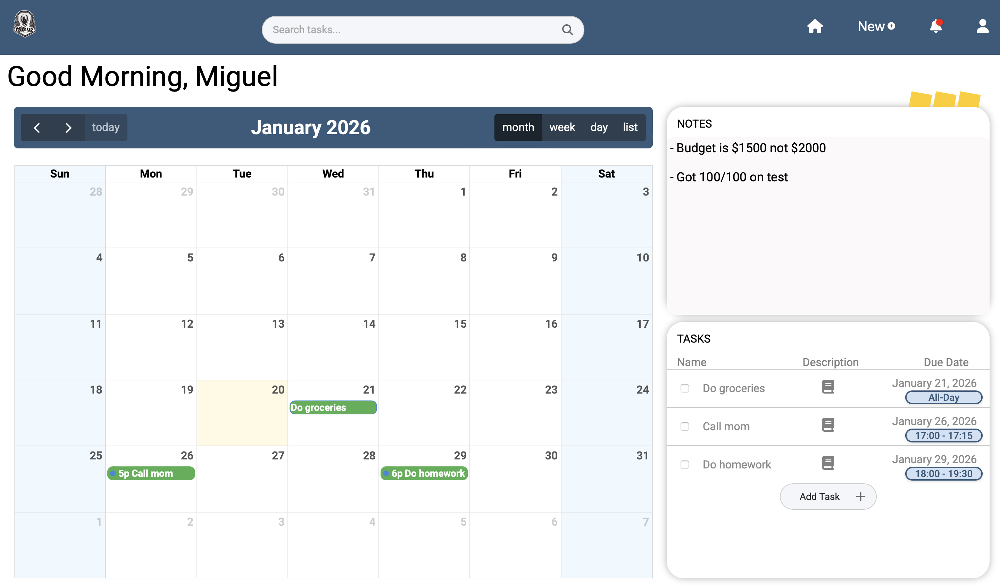
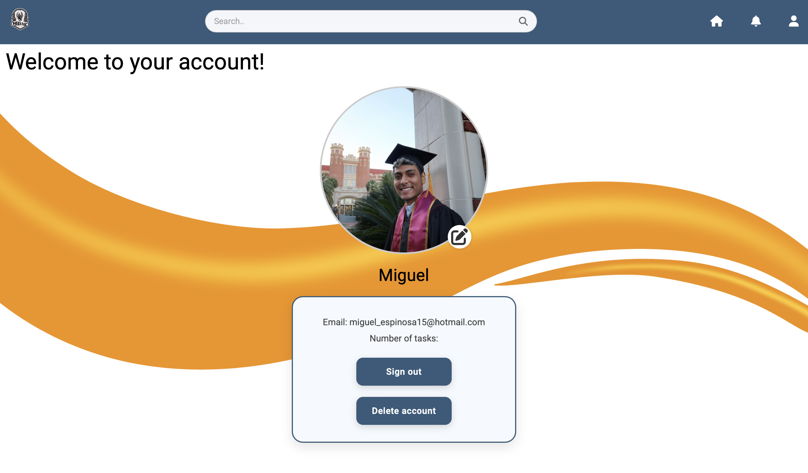
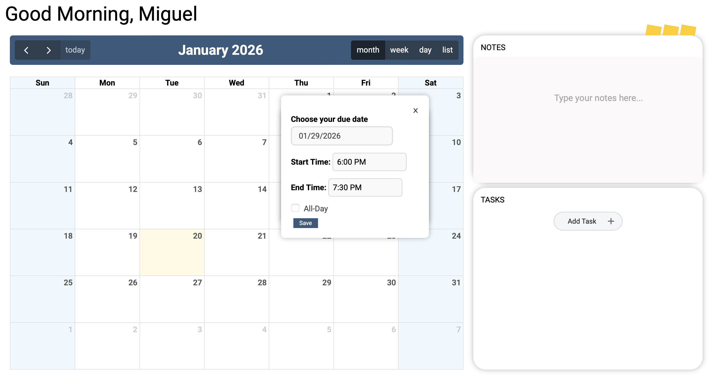

# Task Manager App

A full-stack task management web application that helps users stay organized by creating, updating, and managing their tasks in a clean and intuitive interface. The app includes **user authentication**, calendar scheduling, and persistent storage using MongoDB.

---
## Screenshots

<table>
  <tr>
    <td align="center">
      
       <b>Login</b>
    </td>
    <td align="center">
      
       <b>Home</b>
    </td>
  </tr>
  <tr>
    <td align="center">
      
       <b>Profile</b>
    </td>
    <td align="center">
      
       <b>Tasks</b>
    </td>
  </tr>
</table>

---

---

## 🌐 Live Website  
https://miluz.onrender.com

*(This is the best way to experience the app — no setup required.)*

---

## About the Project

I built this project as a personal full-stack application to strengthen my backend development skills, understand authentication flows, and work with a real database. The app allows each user to have their own account and manage their own tasks securely.

The backend is built with **Node.js and Express**, while **MongoDB** is used for persistent data storage. On the frontend, I integrated external libraries such as **FullCalendar** and **Flatpickr** to enhance the user experience.

---

## Features

- **User Authentication** – Users can sign up, log in, and have their own private tasks  
- **CRUD Operations** – Create, read, update, and delete tasks  
- **Calendar Integration (FullCalendar)** – Visual scheduling of tasks  
- **Date Selection (Flatpickr)** – Easy and interactive date picking  
- **Persistent Storage** – Tasks are stored in MongoDB  
- **Clean UI** – Simple and user-friendly design  
- **Real-time Updates** – Changes reflect immediately in the UI  

---

## Tech Stack

- **Frontend:** HTML, CSS, JavaScript  
- **Backend:** Node.js, Express.js  
- **Database:** MongoDB  
- **APIs / Libraries:** FullCalendar, Flatpickr  

---

## What I Built

Since this was a personal project, I was responsible for the full development lifecycle, including:

- Designing and implementing the frontend UI  
- Building RESTful API routes with Express  
- Implementing user authentication and session handling  
- Designing the MongoDB schema for users and tasks  
- Integrating FullCalendar and Flatpickr  
- Testing, debugging, and refining the app over time  

---

## How to Run Locally (Optional)

If you’d like to run this project locally instead of using the live site:

1. Clone the repository
2. Install dependencies 
3. Create a `.env` file and add your MongoDB connection string  
4. Start the server  
5. Open `http://localhost:3000` in your browser  

---

  
